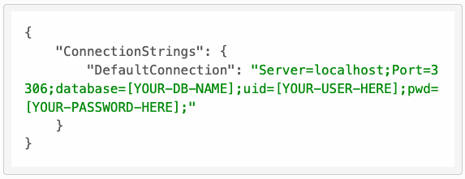
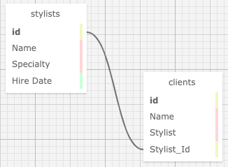

# Eau Claire's Salon

#### By E. Luckie ☀️

#### This MVC application acts as a tool for a salon owner to manage their stylists and salon clients.

## Technologies Used

* C#
* .NET 7.0
* EF Core 7.0
* MySQL Workbench
* HTML
* Markdown
* Git

## Description

This application is intended to help a salon owner keep track of all their stylists and salon clients. The owner is able to see a list of all current stylists, see details for each specific stylist, add new stylists to the system, and add new clients to a specific stylist.

### Paths
**/** Home page welcoming user to the salon. Contains links to view or add stylists, and view or add clients

**/Stylists** Stylists main page showing full list of current stylists and their specialties

**/Clients** Clients main page showing full list of current clients and their respective stylists

**/{Stylists or Clients}/Create** A form to add a new client or stylist (depending on which link was clicked)

**/Stylists/Details/{id}** A page that displays the selected stylist's name, specialty, hire date, and any current clients. Includes links to add a new client to this stylist, edit this stylist, delete this stylist, or return back to the full list of stylists or home page

**/{Stylists or Clients}/Edit/{id}** A form to edit the current client or stylist (depending on which link was clicked). Both forms include links that say _Nevermind_ and take the user back to the respective main pages, and a link instead go back to the main welcome page

**/{Stylists or Clients}/Delete/{id}** A page confirming you'd like to delete the selected Stylist or Client. Clicking the _Take them away_ button officially deletes them, and re-routes the user back to the respective main pages displaying the full list of stylists or clients. If user clicks the _Nevermind_ link instead of the button, the selected client or stylist is not deleted, and the user is re-routed back to the respective main page

**/Clients/Details/{id}** A page that displays the selected client's name, stylist, and any upcoming appointments _**{WORK-IN-PROGRESS}**_

## Setup/Installation Requirements

1. Clone this repository to your desktop
2. In your computer's terminal, navigate to the production level of this directory called _**HairSalon**_
3. In the command line, run the command ``dotnet watch run`` to compile and execute the webpage in Development mode
* Optionally, you can run the command ``dotnet build`` to compile the program without running it

### Connecting the Database
1. Within the production level of this directory, called _**HairSalon**_, create a new file called **appsettings.json**
2. Input the following code into your _**appsettings.json**_ file

* Replace _[ YOUR-DB-NAME ]_ with the name of the database from MySQL Workbench: _**elizabeth_luckie**_
* Replace _[ YOUR-USER-HERE ]_ with your username for MySQL Workbench
* Replace _[ YOUR-PASSWORD-HERE ]_ with your password for MySQL Workbench
* Make sure you save all changes you've made to the file
* If you are planning on pushing your work back to GitHub to a new repository, _make sure to commit your .gitignore file first so that your sensitive information is kept private_

### Database Schemas

_{Leave nothing to chance! You want it to be easy for potential users, employers and collaborators to run your app. Do I need to run a server? How should I set up my databases? Is there other code this application depends on? We recommend deleting the project from your desktop, re-cloning the project from GitHub, and writing down all the steps necessary to get the project working again.}_

## Known Bugs

* No known bugs.

## Stretch Plans

* Include forms to search for stylists &/or clients by name. Display list of results
* Add functionality to add appointments to a client
* Add functionality to add appointments to a stylist & check to ensure no conflicting appointments
* Add functionality to track how much stylists are paid for each appointment
* Add styling

## License

MIT License

Copyright (c) 2023 Luckie